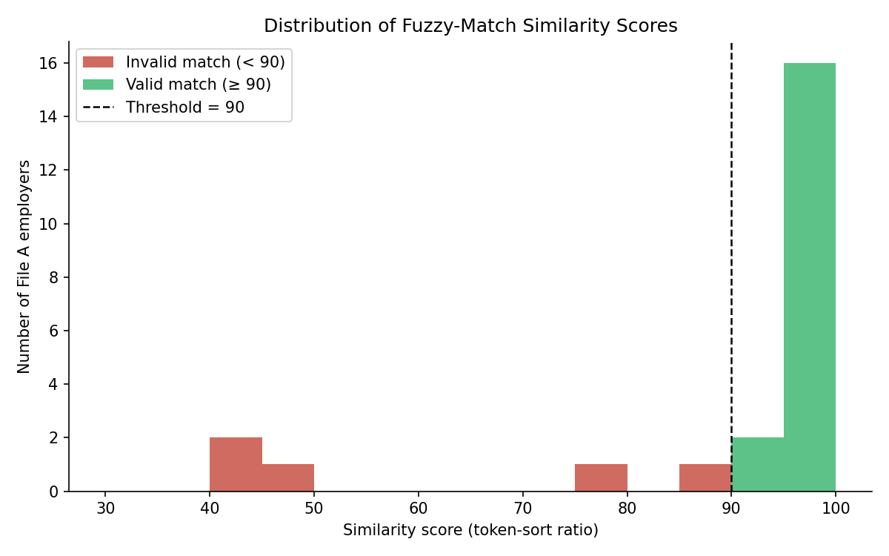
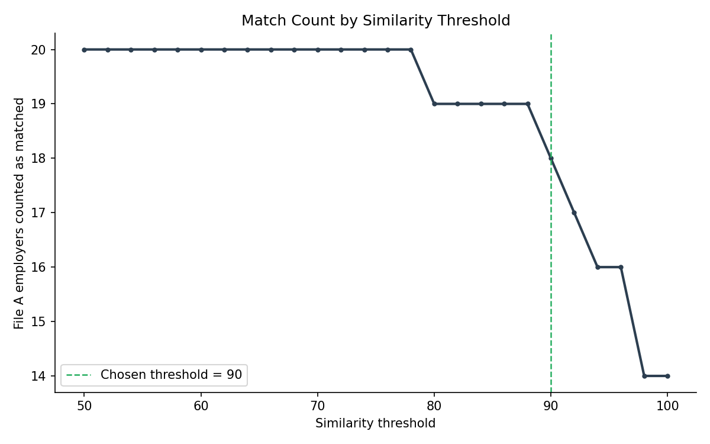

# Employer Name Matching Across Two Administrative Datasets

A fuzzy-matching pipeline that reconciles employer records across two
independently-collected datasets. This is a common data-cleaning problem in labor
economics research, where the same employer is rarely spelled the same way
twice.

> **About this repository**
> This is a **mock recreation** built for portfolio purposes. It reproduces
> the methodology, structure, and logic of a matching project originally
> completed for a confidential labor-economics research initiative. The
> original employer names, IDs, and record counts (one file had 82,000+
> rows; the other, several million) cannot be shared. Every dataset in this
> repository is synthetic, generated by `scripts/generate_mock_data.py`, and
> exists only to demonstrate the pipeline end to end.

## Background

The research required linking employers that appeared in two separate
sources:

| | Source A — "unique" employer list | Source B — multi-year panel |
|---|---|---|
| Grain | one row per employer | one row per employer, per year, per name variant |
| Columns | `employerid`, `employername`, `_freq` | `employer_id`, `emp_name`, `year`, `freq` |
| Span | single snapshot | 2015 – 2019 |
| Key issue | — | duplicate rows from repeated years **and** inconsistent employer naming (e.g. `Milltown Manufacturing Co.` vs. `Milltown Manufacturing Company`) |

Neither file shared a common ID, so employers had to be linked by **name**,
tolerating punctuation differences, legal-suffix differences (`Inc.`,
`LLC`, `Corp.`), and minor misspellings, while excluding names that are
merely *similar* but represent different real companies. 

## Methodology

1. **Clean names.** Lowercase, strip punctuation, normalize `&`, and remove
   common legal suffixes (`Inc`, `LLC`, `Corp`, `Ltd`, `Group`, `Holdings`,
   etc.) from both files.
2. **Collapse duplicates in Source B.**
   - Sum `freq` for exact duplicate `(employer_id, name, year)` rows.
   - For each `employer_id`, keep only the **year with the highest freq**
     (an employer's most representative year).
   - Where multiple `employer_id`s reduce to the same cleaned name - the
     inconsistent-naming case - keep only the one with the **highest freq**.
   - This leaves exactly one candidate row per real-world employer in
     Source B.
3. **Fuzzy-match** each Source A employer against the cleaned Source B
   candidates using `rapidfuzz`'s token-sort ratio, which is robust to
   word-order and legal-suffix noise.
4. **Score and flag.** Keep the single best-scoring candidate per Source A
   employer. Matches scoring **≥ 90** are flagged `valid_match = TRUE`;
   everything else is written out too (flagged `FALSE`) so borderline
   matches can be manually reviewed rather than silently dropped.

## Repository structure

```
employer-name-matching/
├── README.md
├── requirements.txt
├── LICENSE
├── .gitignore
├── data/
│   ├── raw/
│   │   ├── unique_employers.xlsx        # mock Source A
│   │   └── lightcast_employers.xlsx     # mock Source B
│   └── output/
│       └── matched_employers.xlsx       # final matched output
├── assets/
│   ├── similarity_score_distribution.png
│   └── threshold_sensitivity.png
└── scripts/
    ├── generate_mock_data.py            # builds the synthetic inputs
    ├── match_employers.py               # cleaning + matching pipeline
    └── analyze_results.py               # generates the two charts below
```

## Output

`data/output/matched_employers.xlsx` contains one row per Source A employer:

| Column | Description |
|---|---|
| `employer_name / employer_id / freq (file A unique)` | original Source A record |
| `employer_name / employer_id / freq (lightcast)` | best-matching Source B record |
| `year` | the highest-frequency year kept for that Source B employer |
| `similarity_score` | token-sort fuzzy match score (0–100) |
| `cleaned_company` / `cleaned_match` | normalized names used for matching |
| `valid_match` | `TRUE` if `similarity_score ≥ 90` |

Rows are colour-coded (green / red) by `valid_match` for quick visual QA.

## Results & analysis

**Why 90?** The two charts below are what the threshold choice is actually
based on, not just a stated number.



Valid and invalid matches separate into two distinct clusters rather than
overlapping. There's a real gap in the low-90s to high-80s range where
genuine matches (different punctuation, abbreviated words, minor
misspellings) end and coincidental name overlaps begin.



The match count is fairly flat through the high 80s/low 90s and only starts
dropping sharply past the mid-90s, meaning the threshold isn't sitting on
a knife's edge where a small change in cutoff would swing the results
dramatically. That stability is what makes 90 a defensible choice rather
than an arbitrary one.

Regenerate both charts after re-running the pipeline with:

```bash
python scripts/analyze_results.py
```

## Key techniques

`fuzzy string matching` · `record linkage / entity resolution` ·
`data deduplication` · `text normalization` · `pandas groupby aggregation` ·
`openpyxl workbook formatting` · `matplotlib data visualization`

## Running it

```bash
pip install -r requirements.txt
python scripts/generate_mock_data.py   # creates the synthetic input files
python scripts/match_employers.py      # runs the matching pipeline
python scripts/analyze_results.py      # generates the two charts above
```

## Design notes & limitations

- The similarity threshold (90) is a tunable trade-off between precision
  (fewer false matches) and recall (fewer missed real matches); it was set
  by manually reviewing a sample of borderline scores in the original
  project.
- Token-sort ratio was chosen over a plain Levenshtein ratio because
  employer names often have reordered words across sources (e.g.
  `"Harborview Insurance Group"` vs. `"Harborview Insurance Grp"`).
- This is a **name-based** match only, it does not use address, industry
  code, or other identifying fields, since the original sources did not
  reliably share those either.
- At full scale (82K+ rows against several million), the same logic was
  run with pre-blocking (e.g. matching only within the same first letter
  or state) to keep runtime reasonable — omitted here since the mock
  dataset is small enough to match exhaustively.
